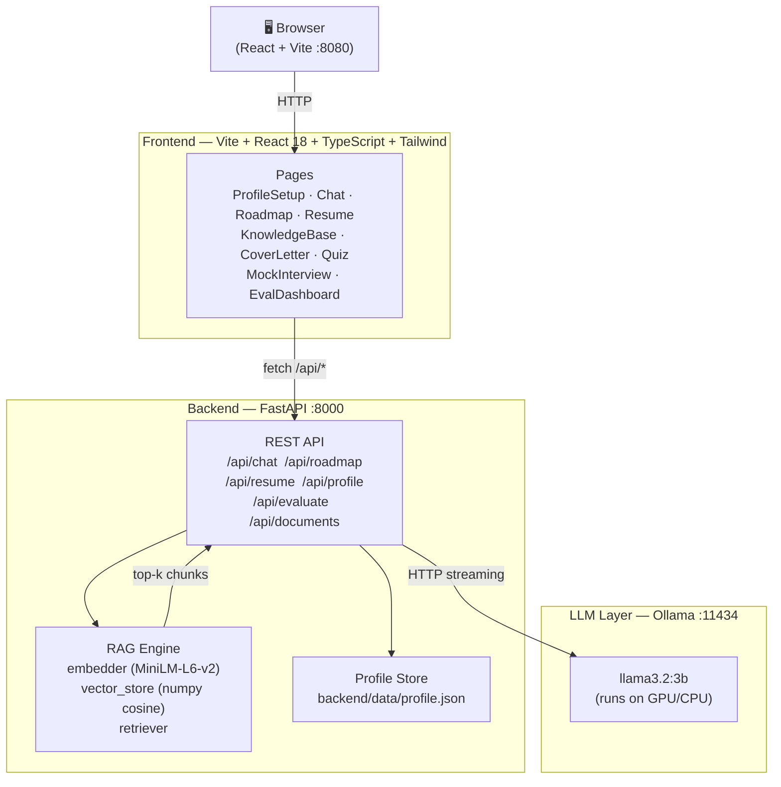

# PathFinder AI — AI Career Roadmap Generator

> **B.Tech Final Year Project — Review 2**  
> Generative AI | RAG | Local LLM (Ollama) | FastAPI | React

Generate personalised career roadmaps, get AI coaching, analyse your resume, and evaluate output quality — all running **100 % locally** on your machine.

---

## Architecture



**Data flow for a chat message:**  
User message → FastAPI → RAG retriever (top-5 course chunks) → Prompt builder → Ollama llama3.2:3b → streamed response → React UI

---

## Features

| # | Feature | Route |
|---|---------|-------|
| 1 | **Profile Setup** — set goal, skills, experience | `/` |
| 2 | **AI Career Chat** — RAG-powered coaching chatbot | `/chat` |
| 3 | **Roadmap Generator** — week-by-week learning plan | `/roadmap` |
| 4 | **Resume Analyser** — upload PDF/DOCX, get skill gap table | `/resume` |
| 5 | **Knowledge Base** — browse & seed course embeddings | `/knowledge-base` |
| 6 | **Cover Letter Generator** — tailored cover letters | `/cover-letter` |
| 7 | **Skill Quiz** — adaptive MCQ quiz on chosen topic | `/quiz` |
| 8 | **Mock Interview** — AI interviewer with feedback | `/interview` |
| 9 | **RAGAS Eval Dashboard** — faithfulness, relevancy, recall | `/eval` |

---

## Tech Stack

| Layer | Technology |
|-------|-----------|
| LLM | Ollama · llama3.2:3b (local, no API key) |
| Embeddings | sentence-transformers `all-MiniLM-L6-v2` |
| Vector store | NumPy cosine similarity (no ChromaDB needed) |
| Backend | Python 3.11 · FastAPI · Uvicorn |
| Resume parsing | PyMuPDF (PDF) · python-docx (DOCX) |
| Frontend | React 18 · TypeScript · Vite · Tailwind CSS · shadcn/ui |
| Charts | Recharts |
| Version control | Git |

---

## Prerequisites

| Tool | Version | Install |
|------|---------|---------|
| Python | 3.11+ | [python.org](https://www.python.org/) |
| Node.js | 18+ | [nodejs.org](https://nodejs.org/) |
| Ollama | latest | [ollama.com](https://ollama.com/) |
| Git | any | [git-scm.com](https://git-scm.com/) |

---

## Setup & Run

### 1. Clone

```powershell
git clone <repo-url>
cd project
```

### 2. Python virtual environment

```powershell
python -m venv .venv
.\.venv\Scripts\pip install -r backend\requirements.txt
```

### 3. Install frontend dependencies

```powershell
cd frontend
npm install
cd ..
```

### 4. Pull the LLM model

```powershell
ollama pull llama3.2:3b
```

### 5. Seed course embeddings (first run only)

```powershell
.\.venv\Scripts\python backend\seed_courses.py
```

### 6. Launch everything

```powershell
.\start.ps1
```

This single command:
- Kills any stale processes on ports 8000 / 8080
- Starts **Ollama** in the background
- Opens a new terminal window with the **FastAPI** backend (`http://localhost:8000`)
- Opens a new terminal window with the **Vite** dev server (`http://localhost:8080`)

Open **http://localhost:8080** in your browser.

---

## Project Structure

```
project/
├── start.ps1                   # One-command launcher
├── backend/
│   ├── app/
│   │   ├── main.py             # FastAPI app, CORS, router registration
│   │   ├── api/
│   │   │   ├── chat.py         # /api/chat  — RAG + Ollama streaming
│   │   │   ├── roadmap.py      # /api/roadmap — personalised plan
│   │   │   ├── resume.py       # /api/resume/* — PDF/DOCX parsing
│   │   │   ├── profile.py      # /api/profile — GET/POST profile JSON
│   │   │   ├── evaluate.py     # /api/evaluate — RAGAS-style scoring
│   │   │   ├── documents.py    # /api/documents — KB management
│   │   │   ├── cover_letter.py # /api/cover-letter
│   │   │   ├── interview.py    # /api/interview
│   │   │   └── quiz.py         # /api/quiz
│   │   └── rag/
│   │       ├── embedder.py     # sentence-transformers wrapper
│   │       ├── vector_store.py # numpy cosine similarity store
│   │       ├── ingestor.py     # chunk + embed text
│   │       ├── retriever.py    # top-k semantic retrieval
│   │       └── course_data.py  # 100+ curated courses (25 skill areas)
│   ├── data/
│   │   ├── profile.json        # persisted user profile
│   │   └── vector_store.json   # embedded course chunks
│   └── seed_courses.py         # one-off embedding seeder
└── frontend/
    ├── src/
    │   ├── App.tsx             # Router + ErrorBoundary
    │   ├── lib/
    │   │   └── api.ts          # apiGet / apiPost / apiPostForm helpers
    │   ├── components/
    │   │   ├── ErrorBoundary.tsx
    │   │   └── ui/             # shadcn components
    │   └── pages/
    │       ├── Index.tsx        # Landing / home
    │       ├── ProfileSetup.tsx # Goal & skills form
    │       ├── ChatPage.tsx     # RAG chat UI
    │       ├── Roadmap.tsx      # Week-by-week roadmap view
    │       ├── ResumeAnalyzer.tsx
    │       ├── KnowledgeBase.tsx
    │       ├── CoverLetterGenerator.tsx
    │       ├── SkillQuiz.tsx
    │       ├── MockInterview.tsx
    │       └── EvalDashboard.tsx
    └── vite.config.ts          # Proxy /api → :8000
```

---

## API Reference (quick)

| Method | Endpoint | Description |
|--------|----------|-------------|
| GET | `/api/profile` | Load saved profile |
| POST | `/api/profile` | Save profile |
| POST | `/api/chat` | RAG chat (streaming) |
| POST | `/api/roadmap` | Generate roadmap |
| POST | `/api/resume/extract-profile` | Parse resume → skills |
| POST | `/api/evaluate` | RAGAS scoring |
| GET | `/docs` | Swagger UI |

---

## Demo Walkthrough (Review 2)

1. **Profile** → Set goal (e.g., "ML Engineer"), current skills, experience level → Save
2. **Roadmap** → Click Generate → See 12-week plan with recommended courses
3. **Resume** → Upload a PDF/DOCX → View extracted skills and gap table → Add skills to KB
4. **Chat** → Ask "What should I learn next for NLP?" → RAG pulls relevant course chunks
5. **Eval** → Run evaluation → See faithfulness / answer relevancy / context recall bar charts → Export JSON

---

## RAGAS Evaluation

The `/api/evaluate` endpoint implements three RAGAS-style metrics using cosine similarity (no external API required):

| Metric | Formula |
|--------|---------|
| **Faithfulness** | `cos_sim(answer_embedding, context_embedding)` |
| **Answer Relevancy** | `cos_sim(answer_embedding, question_embedding)` |
| **Context Recall** | `max cos_sim(context_chunk, answer_embedding)` per chunk |

Results displayed as bar charts in **EvalDashboard** and exportable as JSON.

---

## Environment

- GPU: NVIDIA RTX 3050 (4 GB VRAM) — llama3.2:3b runs comfortably
- OS: Windows 11
- Python: 3.11
- Node: 18

---

## Team

| Name | Roll No |
|------|---------|
| Jaydip Chavan | TY-XX |

**Guide:** [Supervisor Name]  
**Department:** Computer Engineering  
**Institute:** [College Name]  
**Year:** 2024–25
